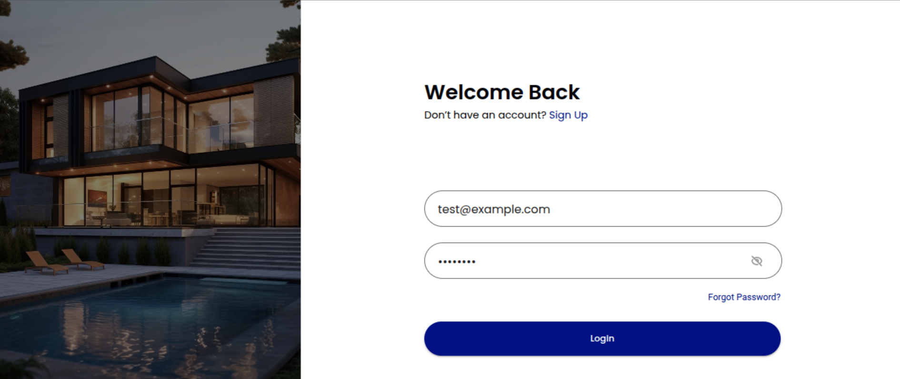

# 🏘️ Manzeli – Real Estate Management Web App

**Manzeli** is a modern, responsive real estate management web application built using **React**, **Material UI**, and **Context API**. It allows both users and companies to manage properties, tenants, subscription plans, and more — all with a secure and user-friendly experience.



---

## 🚀 Features

- 🏠 Property Listing & Management  
- 👥 Tenant Management  
- 💳 Subscription & Plan Handling  
- 🔐 Secure Authentication System  
- 🌐 Google Maps Integration  
- 📅 Date Pickers & Form Handling  
- 📱 Responsive UI with Material UI Components  
- ⚙️ API Integration via Axios  
- 🧠 Global State Management using Context API  

---

## 🧰 Tech Stack

- **React 18**
- **Material UI 5**
- **React Router DOM 6**
- **Context API**
- **Axios**
- **Google Maps API**
- **Date-FNS**
- **React Datepicker**

---

## 📂 Project Structure

```

manzeli-frontend/
├── public/
├── src/
│   ├── assets/
│   ├── components/
│   ├── context/
│   ├── pages/
│   ├── services/
│   └── utils/
└── screenshots/signup.png

````

## 📦 Installation

```bash
git clone https://github.com/Kamran0925/manzeli-frontend.git
cd manzeli-frontend
npm install
npm start
````

---

## 🧪 Testing

```bash
npm test
```

---

## 🛠️ Future Improvements

* Dashboard analytics
* Admin role and access controls
* Mobile-first UI refinements
* Real-time chat or notifications

---

## 📬 Contact

Built by [Kamran Rizwan](https://www.linkedin.com/in/kamran-rizwan) – open to collaboration and freelance opportunities!
